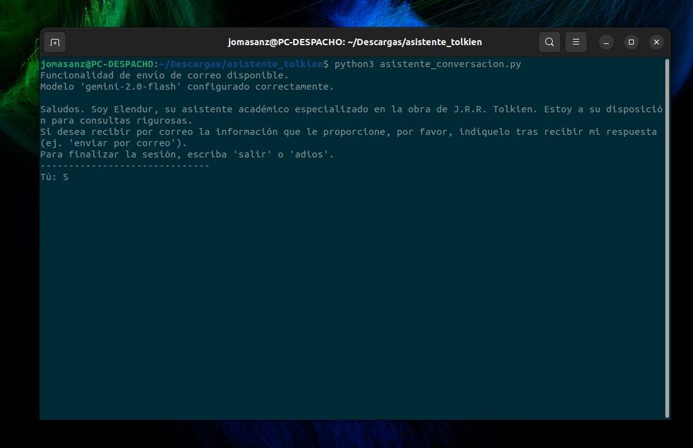
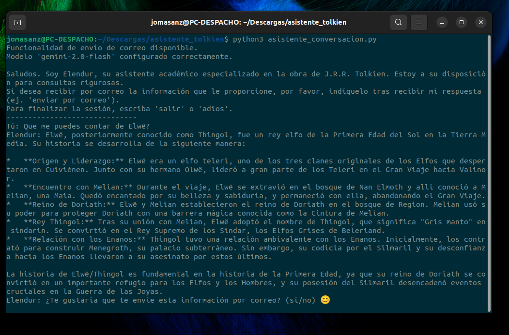

# Elendur: Agente de IA especializado en Tolkien y Funcionalidad de Envío por Correo

Este proyecto es un script de Python que implementa un asistente conversacional llamado "Elendur", especializado en la obra de J.R.R. Tolkien (El Señor de los Anillos, El Hobbit, etc.). Utiliza la API de Google Gemini para responder preguntas sobre este fascinante universo y ofrece la funcionalidad de enviar por correo electrónico la última respuesta proporcionada por la IA, si el usuario así lo solicita.

## Características

* Conversación interactiva con un asistente de IA especializado en Tolkien.
* Asistente con una personalidad amigable y entusiasta ("Elendur").
* Capacidad de responder preguntas sobre libros, personajes, lugares y eventos de la Tierra Media.
* Funcionalidad para enviar la última respuesta del asistente por correo electrónico.
* Configuración y gestión de credenciales de API y correo mediante archivo `.env` para mayor seguridad.
* Interfaz de consola sencilla.

## Requisitos

* Python 3.7 o superior.
* Acceso a la API de Google Gemini y una [clave de API](https://aistudio.google.com/app/apikey).
* Una cuenta de correo electrónico con acceso SMTP habilitado. Se recomienda encarecidamente usar una **contraseña de aplicación** específica para este script en lugar de la contraseña principal de tu cuenta de correo (busca cómo generar una contraseña de aplicación para tu proveedor, ej. Gmail).
* El servidor y puerto SMTP de tu proveedor de correo.

## Configuración

1.  **Clona el Repositorio:**
    ```bash
    git clone <URL_DE_TU_REPOSITORIO>
    ```
    Sustituye `<URL_DE_TU_REPOSITORIO>` por la URL donde publiques este código.

2.  **Navega al Directorio del Proyecto:**
    ```bash
    cd <nombre_del_directorio_del_repositorio>
    ```

3.  **Instala las Dependencias:**
    ```bash
    pip install google-generativeai python-dotenv
    ```

4.  **Crea el Archivo `.env`:**
    * Crea un archivo llamado `.env` en la raíz del proyecto (en el mismo directorio que el script principal `asistente_conversacion.py`).
    * Copia el siguiente contenido en él y reemplaza los valores entre `<...>` con tus credenciales:

    ```dotenv
    # Clave de la API de Google AI (Gemini)
    GEMINI_API_KEY=<TU_CLAVE_DE_API_DE_GEMINI>
    # Nombre del modelo de Gemini a utilizar (gemini-pro es recomendado para chat)
    IA_GENERATIVE_MODEL=gemini-pro

    # Credenciales y configuración del correo electrónico remitente
    EMAIL_ADDRESS=<TU_CORREO_REMITENTE@ejemplo.com>
    EMAIL_PASSWORD=<TU_CONTRASEÑA_O_CONTRASEÑA_DE_APP>
    SMTP_SERVER=<SERVIDOR_SMTP_DE_TU_CORREO> # Ej: smtp.gmail.com
    SMTP_PORT=<PUERTO_SMTP> # Ej: 587 (para TLS) o 465 (para SSL)
    ```
    * **¡Importante!** No compartas tu archivo `.env`. Si usas Git, asegúrate de que `.env` esté listado en tu archivo `.gitignore` para no subirlo accidentalmente al repositorio.

## Cómo Ejecutar

1.  Asegúrate de haber completado todos los pasos de [Configuración](#configuración).
2.  Abre una terminal en el directorio raíz del proyecto.
3.  Ejecuta el script Python:
    ```bash
    python asistente_conversacion.py
    ```

## Cómo Usar

1.  Ejecuta el script. El asistente Elendur se iniciará y te saludará.
2.  Puedes empezar a hacer preguntas sobre cualquier aspecto del mundo de Tolkien (personajes, lugares, eventos, libros, etc.).
3.  Elendur te responderá a través de la consola.
4.  **Después de cada respuesta que te dé Elendur**, el script te preguntará automáticamente: `Elendur: ¿Te gustaría que te envíe esta información por correo? (sí/no) 😊`.
5.  Si respondes `sí` (o `si`, `ok`, `yes`), el script te pedirá la dirección de correo electrónico a la que deseas enviar la información.
6.  Introduce la dirección de correo y pulsa Enter. El script intentará enviar la **última respuesta completa** de Elendur a esa dirección.
7.  Si respondes cualquier otra cosa (como `no` o tu siguiente pregunta), la conversación continuará normalmente sin enviar correo.
8.  Para finalizar la conversación, escribe `salir` o `adios`.


## Capturas de pantalla
Algunos ejemplos de la conversación con el asistente




## Limitaciones Conocidas

* El script debe estar en ejecución continua en una terminal para poder interactuar y detectar las solicitudes de envío de correo. No funciona como un servicio en segundo plano persistente.
* La detección de la solicitud de envío por correo se basa en palabras clave simples ("sí", "enviar por correo", etc.) en la respuesta inmediata a la pregunta de seguimiento del script.
* La dirección de correo del destinatario se pide interactivamente cada vez que se solicita un envío.
* Manejo de errores básico.

---

Si encuentras algún problema o tienes sugerencias, por favor, abre un issue en este repositorio. ¡Que disfrutes explorando la Tierra Media con Elendur!
